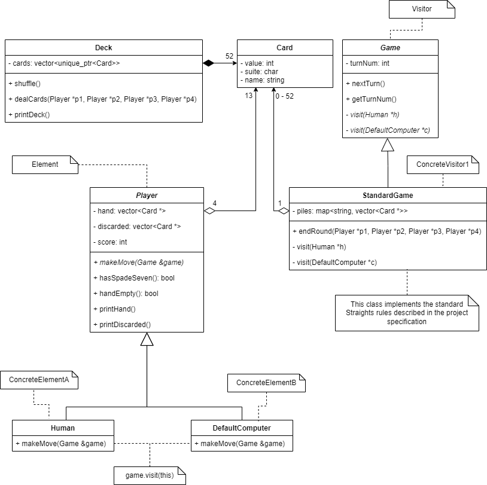

# Straights

Straights is a four-player game. The objective is to get the fewest number of points among the players. The game ends when
one player accumulates 80+ points, and the player with the lowest score is declared the winner. If the lowest score is a
tie, then all players with that score win.

# UML Diagram

